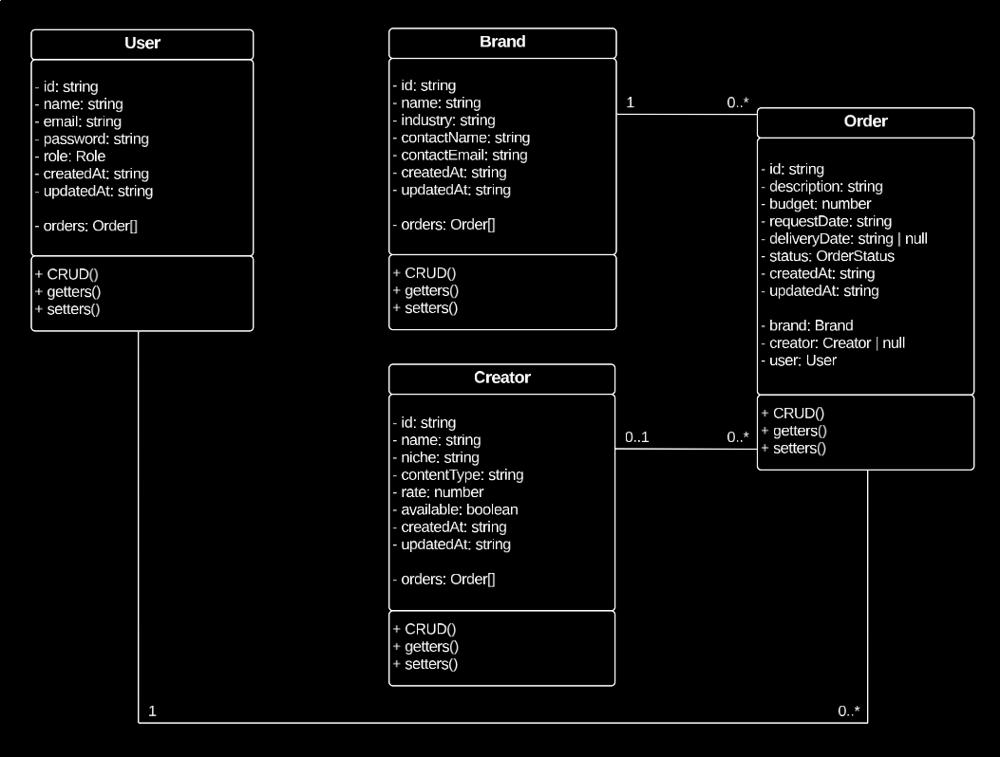
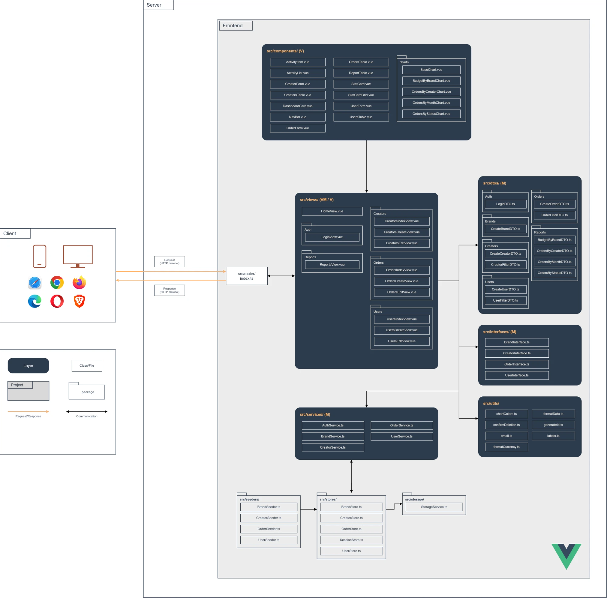

# Team Logo

# Verbal Model
Creatorly is an internal dashboard (SPA) for a UGC (User Generated Content) creator agency. It centralizes the agency's daily operation: the catalog of creators, the brands that request content, and the orders that connect both, from the moment a brand makes a request until the creator delivers the content. Administrators manage creators, brands, and users, while content coordinators manage their orders and check the reports. Orders can be filtered by brand, creator, or status, and tables and charts show how many orders exist per status or per month and how much budget has been committed, supporting decisions such as which creator to assign to the next order or which brand is the most active.

# Class Diagram

# Architecture Diagram

