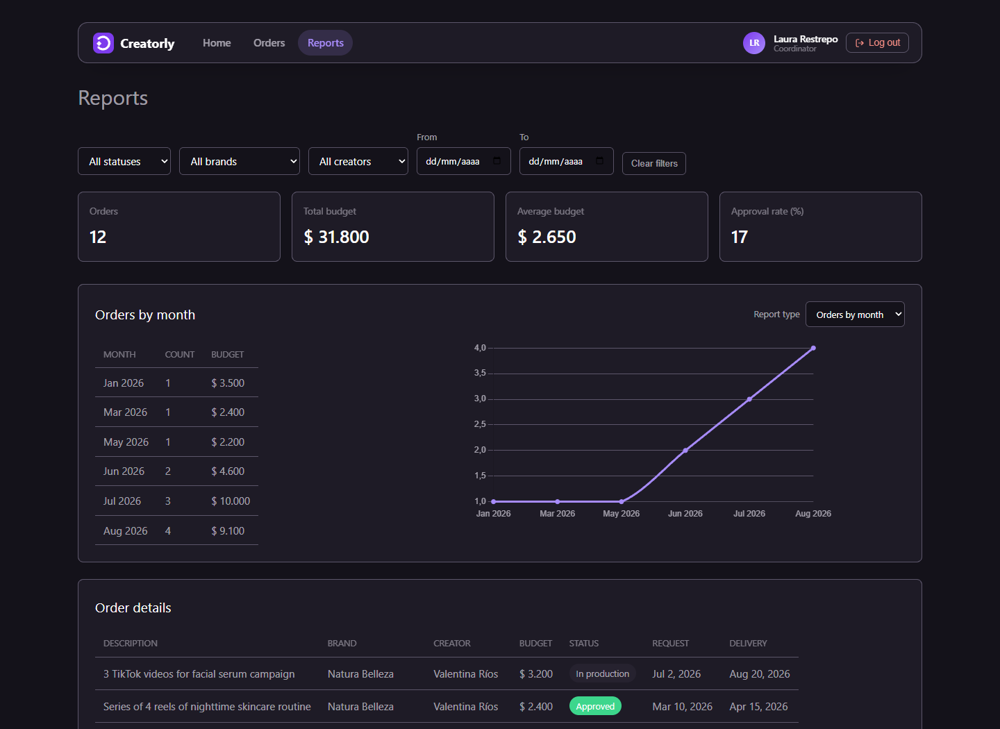
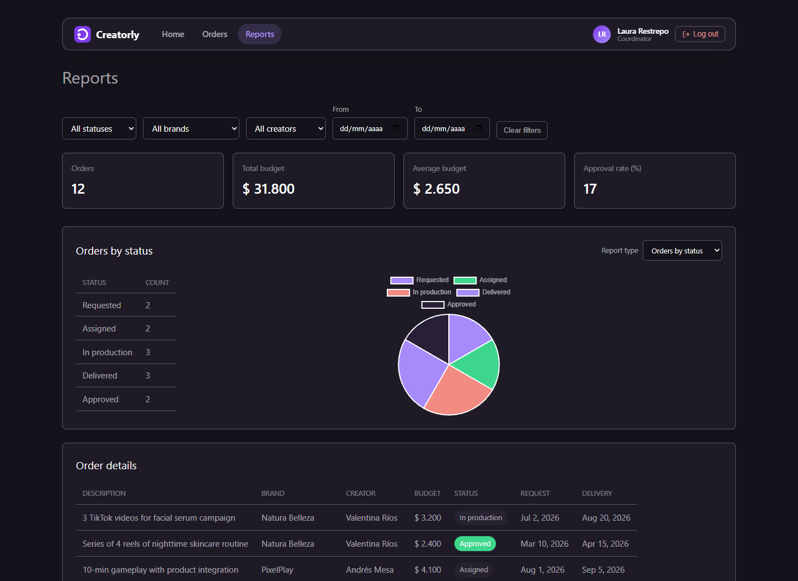
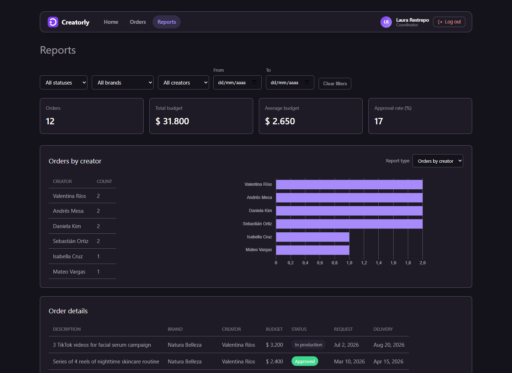
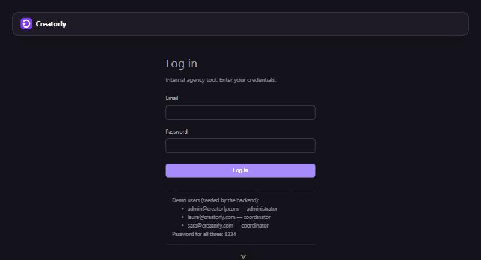

# Screenshots

Screenshots of the app's **3 most important sections**.

## 1. Orders (list with selector + table + chart)

Two screenshots: filter by status and filter by brand, both with a selector, table, and pie chart (Chart.js) on the same screen.

---

## 2. Reports (selector + tables + 4 charts)

The 4 Chart.js charts: orders by month (line), orders by status (pie), orders by creator (bars), and budget by brand (bars).

---

---

---

## 3. Login (role-based access)

