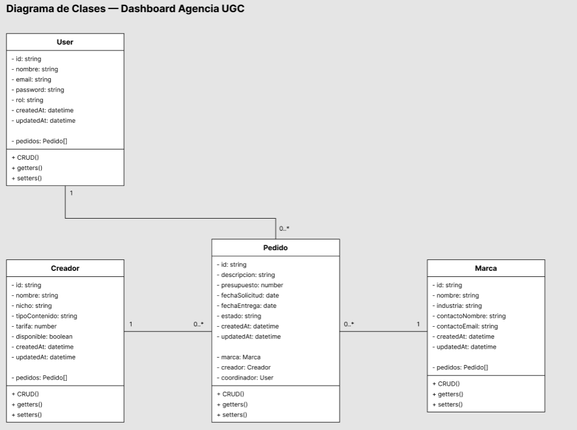
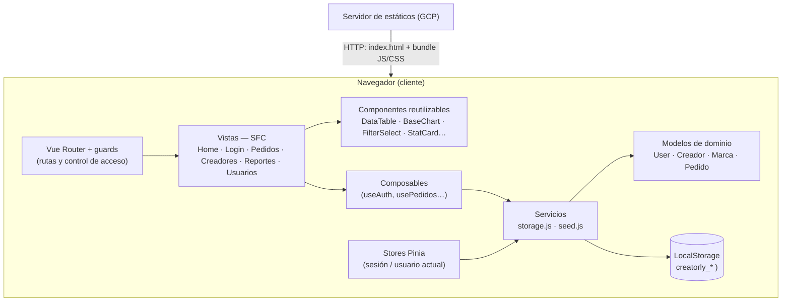
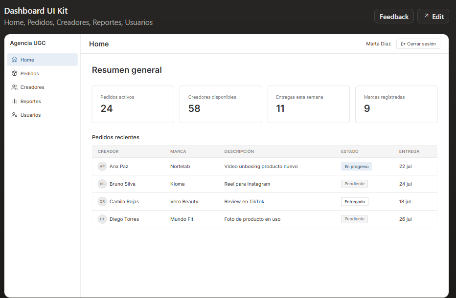
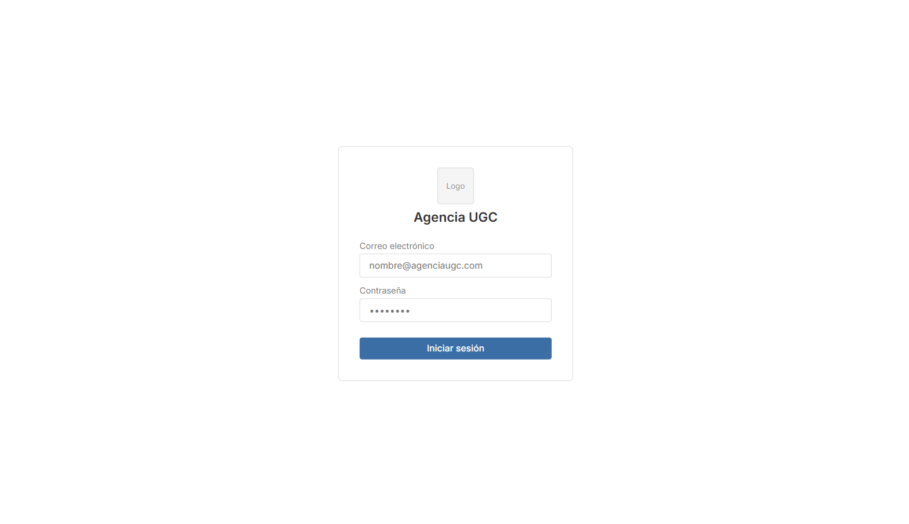
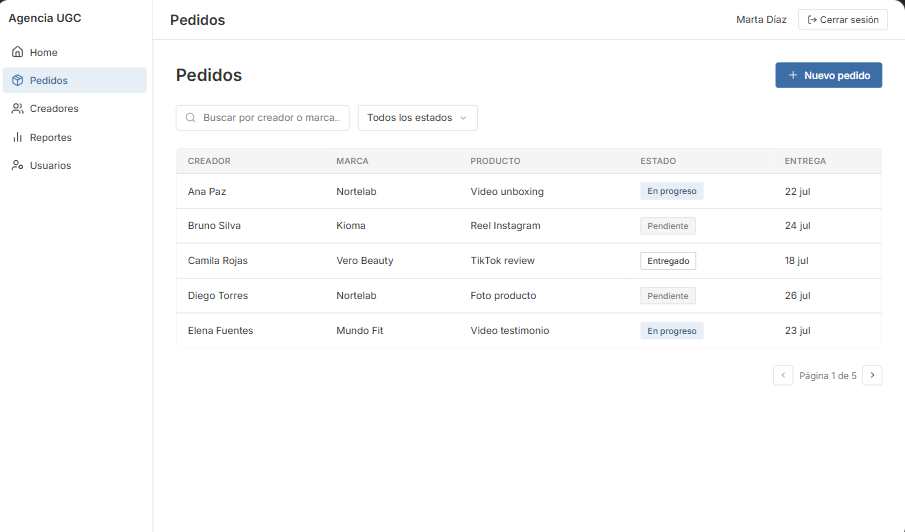
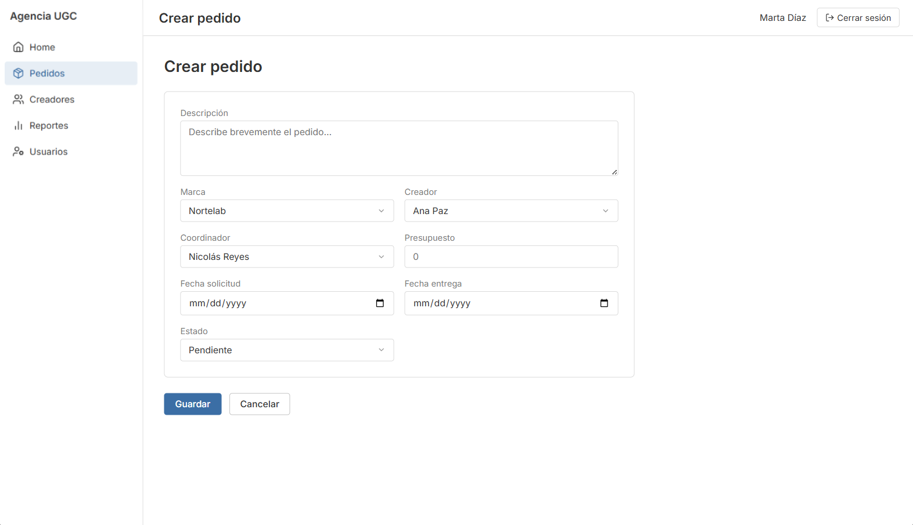
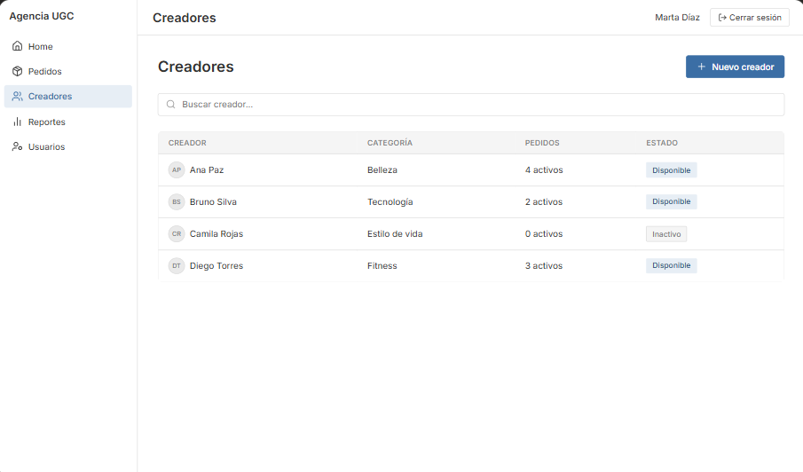
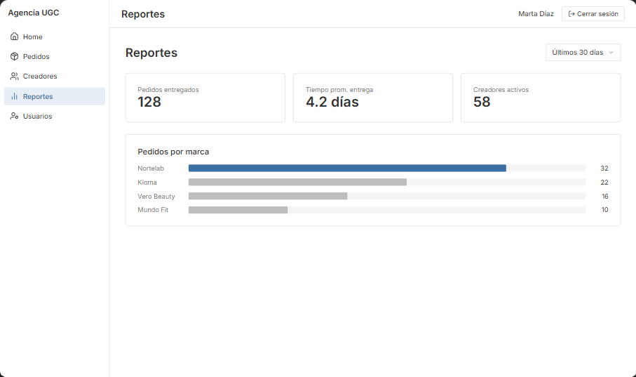
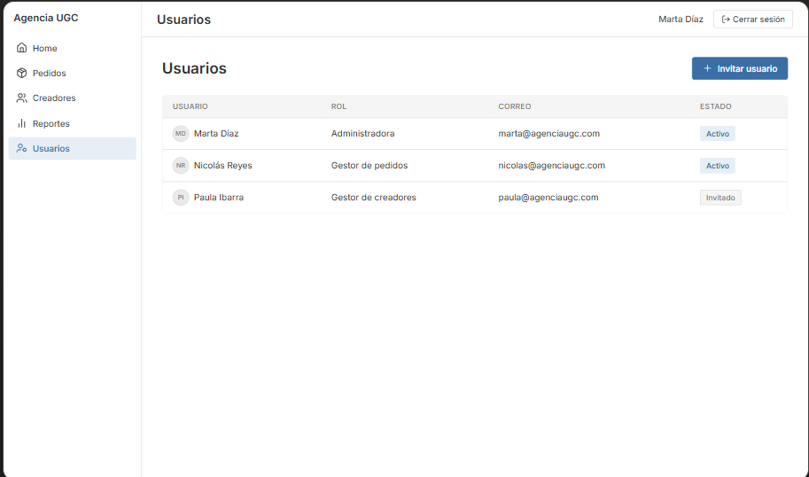

# Entregable 1 Parte 1

> 📌 **Nota para el equipo:** las imágenes referenciadas (`assets/…`) están en `docs/wiki/assets/` del repo. Al publicar este wiki en GitHub, subirlas con la interfaz del wiki (arrastrar la imagen al editor) y ajustar las rutas.

## 1. Logo del equipo

> ⚠️ **PENDIENTE:** el equipo aún no ha diseñado el logo. Espacio reservado — subir aquí la imagen cuando exista.

## 2. Modelo verbal definitivo

**¿Qué es?** Creatorly es una herramienta interna (dashboard tipo SPA) para que una agencia de contenido UGC (User Generated Content) administre su operación diaria: su catálogo de creadores, las marcas que le solicitan contenido, y los pedidos que conectan a ambos — desde que la marca hace la solicitud hasta que el creador entrega el contenido.

**Problema que resuelve.** La agencia funciona como intermediario entre las marcas que necesitan contenido y los creadores que lo producen. Sin una herramienta central, esa coordinación (qué marca pidió qué, a qué creador se asignó, en qué estado va, cuánto se pactó) vive dispersa en chats de WhatsApp, hojas de cálculo y notas sueltas. El dashboard centraliza toda esa operación en un solo lugar.

**Alcance (versión inicial).** El sistema se enfoca en la operación interna de la agencia: gestión del catálogo de creadores, gestión de las marcas/clientes, y el ciclo de vida de los pedidos de contenido (solicitud → asignación → producción → entrega), con su presupuesto y su seguimiento de estado. Los datos se simulan en LocalStorage del navegador. Extensión futura prevista: medición del rendimiento del contenido publicado (vistas, engagement), a evaluar con el profesor.

**Actores involucrados.**
- *Administrador de la agencia:* acceso total; gestiona creadores, marcas y usuarios internos. Es quien accede a las páginas restringidas (solo-admin).
- *Coordinador de contenido (usuario estándar):* gestiona los pedidos que tiene a cargo y consulta los reportes del sistema.

**Beneficio de la propuesta.** Un solo lugar donde la agencia puede ver todos sus pedidos filtrables por marca, creador o estado, con tablas y gráficos (Chart.js) que muestran cuántos pedidos hay por estado o por mes y cuánto presupuesto se ha comprometido. Esto apoya decisiones concretas como a qué creador asignar el próximo pedido o qué marca es la más activa.

## 3. Diagrama de clases

El sistema se modela con exactamente **4 clases**. **Pedido** es la clase central del dominio: relaciona a la **Marca** que solicita el contenido, al **Creador** al que se asigna, y al **User** (coordinador) que lo gestiona internamente.

| Clase | Atributos |
|---|---|
| **User** | id, nombre, email, password, rol (`admin` \| `coordinador`), createdAt, updatedAt |
| **Creador** | id, nombre, nicho, tipoContenido, tarifa, disponible, createdAt, updatedAt |
| **Marca** | id, nombre, industria, contactoNombre, contactoEmail, createdAt, updatedAt |
| **Pedido** | id, descripcion, presupuesto, fechaSolicitud, fechaEntrega, estado, createdAt, updatedAt, marca, creador, coordinador |

**Relaciones y cardinalidades:**
- Un User (coordinador) gestiona muchos Pedido → 1 a 0..*
- Un Creador es asignado a muchos Pedido → 1 a 0..*
- Una Marca solicita muchos Pedido → 1 a 0..*
- Se usa 0..* (y no 1..*) porque un creador o una marca recién registrados pueden existir sin pedidos asociados aún.

## 4. Diagrama de arquitectura

> ⚠️ **Borrador generado como base** — el equipo puede reemplazarlo por su versión final si prefiere otro estilo.

Capas de la SPA (de afuera hacia adentro): **enrutamiento** (router + guards) → **vistas** (páginas SFC) → **componentes reutilizables y composables** (presentación y lógica de UI) → **stores** (estado compartido) → **servicios y modelos** (dominio) → **LocalStorage** (persistencia simulada). El servidor solo entrega estáticos; toda la ejecución ocurre en el navegador del cliente.

## Anexo: sketches de las 7 páginas

| # | Página | Sketch |
|---|---|---|
| 1 | Home |  |
| 2 | Login |  |
| 3 | Pedidos (CRUD #2 + selector/tabla/Chart.js) |  |
| 4 | Crear / Editar Pedido |  |
| 5 | Creadores (solo-admin, CRUD #1) |  |
| 6 | Reportes (selector/tabla/Chart.js) |  |
| 7 | Usuarios (solo-admin) |  |
