# Deliverable 1 Part 1

> 📌 **Note for the team:** the referenced images (`assets/…`) are in `docs/wiki/assets/` in the repo. When publishing this wiki on GitHub, upload them through the wiki UI (drag the image into the editor) and adjust the paths.

## 1. Team logo

**Creatorly**'s logotype uses the *Monogram + Meaning* concept combined with *Negative Space*:
- **Concept:** Represents a monogram of the **C** in Creatorly whose two ends symbolize the two parties involved (**Brand** on top and **Creator** on the bottom). In the negative space of the opening sits a **diamond (node at 45°)** representing the **Order** as the indispensable connector managed by the agency.
- **Wordmark typeface:** `Unbounded 600`.
- **Colors:** Stroke in `--color-primary` (`#7c3aed`) and center node in white (`#ffffff`).
- **Technical spec and SVG:** See full detail in [Brand Identity and Design System](identidad-de-marca).

## 2. Final verbal model

**What is it?** Creatorly is an internal tool (SPA dashboard) for a UGC (User Generated Content) agency to manage its daily operation: its creators catalog, the brands that request content from it, and the orders that connect both — from the moment a brand makes the request until the creator delivers the content.

**Problem it solves.** The agency works as an intermediary between the brands that need content and the creators who produce it. Without a central tool, that coordination (which brand requested what, which creator it was assigned to, what status it's in, what budget was agreed) lives scattered across WhatsApp chats, spreadsheets, and loose notes. The dashboard centralizes that whole operation in one place.

**Scope (initial version).** The system focuses on the agency's internal operation: managing the creators catalog, managing brands/clients, and the content orders lifecycle (request → assignment → production → delivery), with its budget and status tracking. Data lives in the backend (NestJS + TypeORM + SQLite) and the SPA consumes it through its REST API. Planned future extension: measuring published content performance (views, engagement), to be evaluated with the professor.

**Actors involved.**
- *Agency administrator:* full access; manages creators, brands, and internal users. The only one who accesses the restricted (admin-only) pages.
- *Content coordinator (standard user):* manages the orders in their charge and checks the system's reports.

**Value proposition.** A single place where the agency can see all its orders, filterable by brand, creator, or status, with tables and charts (Chart.js) showing how many orders exist per status or per month and how much budget has been committed. This supports concrete decisions like which creator to assign the next order to or which brand is the most active.

## 3. Class diagram

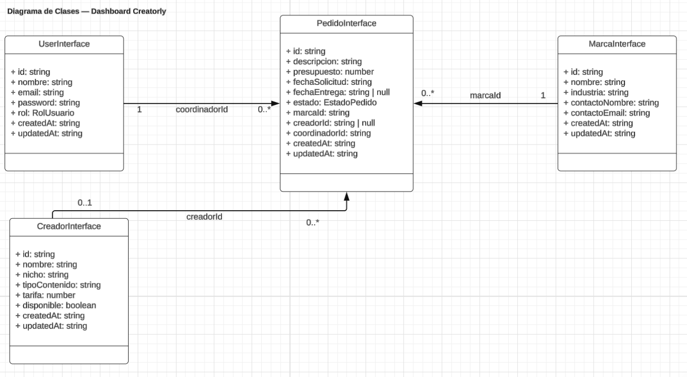

The system is modeled with exactly **4 classes**. **Order** is the central domain class: it relates the **Brand** requesting the content, the **Creator** it's assigned to, and the **User** (coordinator) who manages it internally.

| Class | Attributes |
|---|---|
| **User** | id, name, email, password, role (`admin` \| `coordinator`), createdAt, updatedAt |
| **Creator** | id, name, niche, contentType, rate, available, createdAt, updatedAt |
| **Brand** | id, name, industry, contactName, contactEmail, createdAt, updatedAt |
| **Order** | id, description, budget, requestDate, deliveryDate, status, createdAt, updatedAt, brand, creator, coordinator |

**Relationships and cardinalities:**
- A User (coordinator) manages many Orders → 1 to 0..*
- A Creator is assigned to many Orders → 1 to 0..*
- A Brand requests many Orders → 1 to 0..*
- 0..* (rather than 1..*) is used because a newly registered creator or brand can exist without any associated orders yet.

## 4. Architecture diagram

Module map: each box is a real folder in `src/`, each row inside it a real file. Arrows mean "uses/imports" (A → B means A imports something from B), verified import by import against the code.

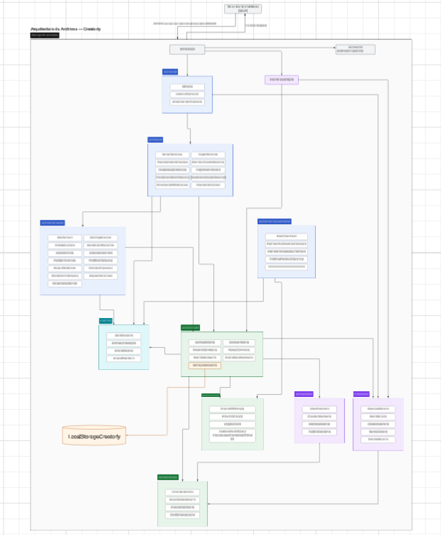

Detail by parts (the full diagram is too large to read straight through):

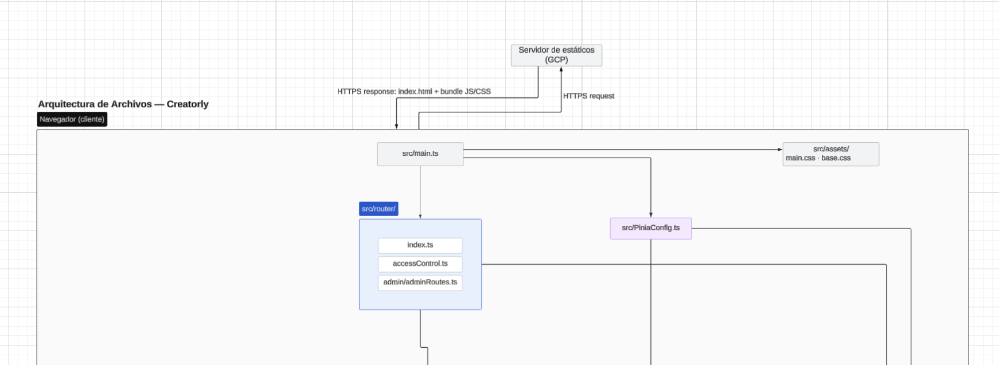

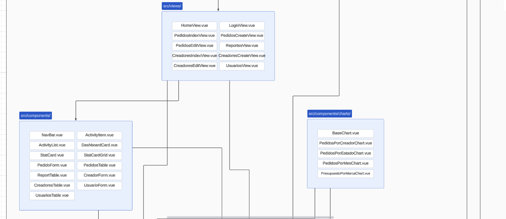

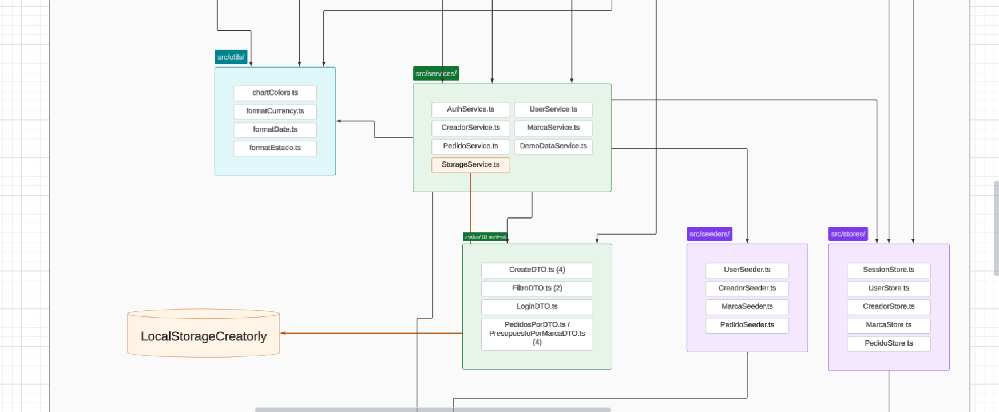

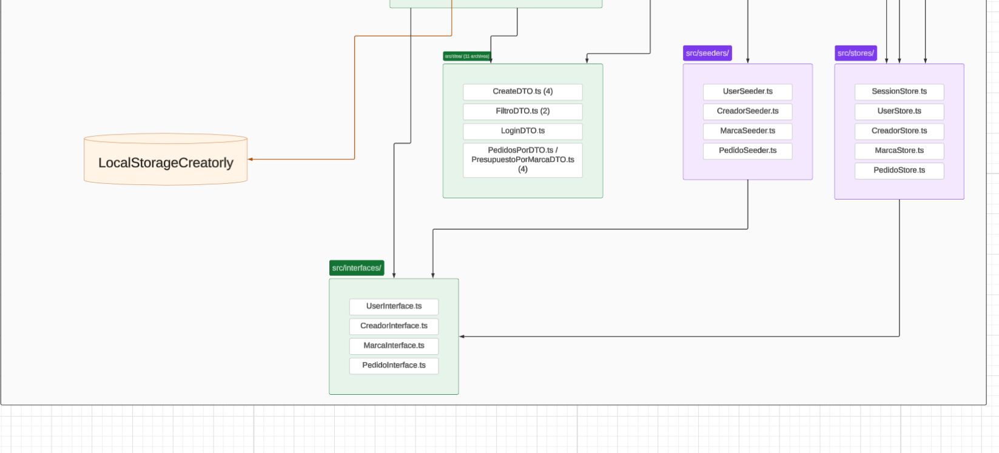

[Diagram link](https://lucid.app/lucidchart/9f425ba0-8f21-44b7-b40a-330e12673750/edit?viewport_loc=-12152%2C4670%2C4484%2C1947%2Cp1&invitationId=inv_f07ff397-f817-46c1-89ba-60e26ed17a5c)

Layers (from outside in): `main.ts` starts Pinia (`PiniaConfig.ts`) and the `router` → **views** (`views/`, one per route, loading their data in `onMounted`) → **reusable components** (`components/`, with the Chart.js charts isolated in `components/charts/`) → **services** (`services/`, classes of static methods that call the API with axios, typed with `interfaces/` and `dtos/`) → **backend REST API** (`backend/`, NestJS + TypeORM) → **SQLite** (`backend/database.sqlite`). The only state kept in the browser is the session: `SessionStore` (token and current user) and `storage/StorageService` (the only door to LocalStorage, which holds just the JWT). Two documented exceptions to "views only talk to services": the router guard (`accessControl.ts`) calls `AuthService.restoreSession()` to rebuild the session after a reload before resolving a navigation; and `AuthService` is the only module that writes the `Authorization` header, which it sets once on `axios.defaults.headers.common` so no other service has to know the token exists.

## Appendix: page screenshots

> The original Phase 0 sketches became outdated compared to the already-implemented real app.

| # | Page | Screenshot |
|---|---|---|
| 1 | Home | 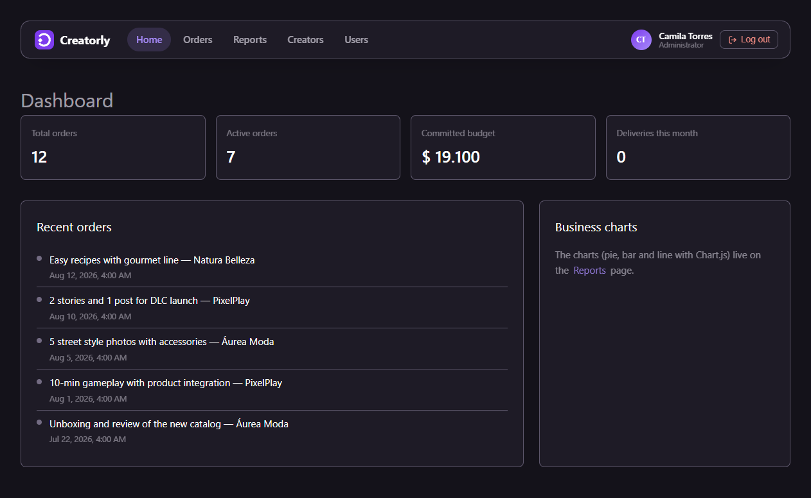 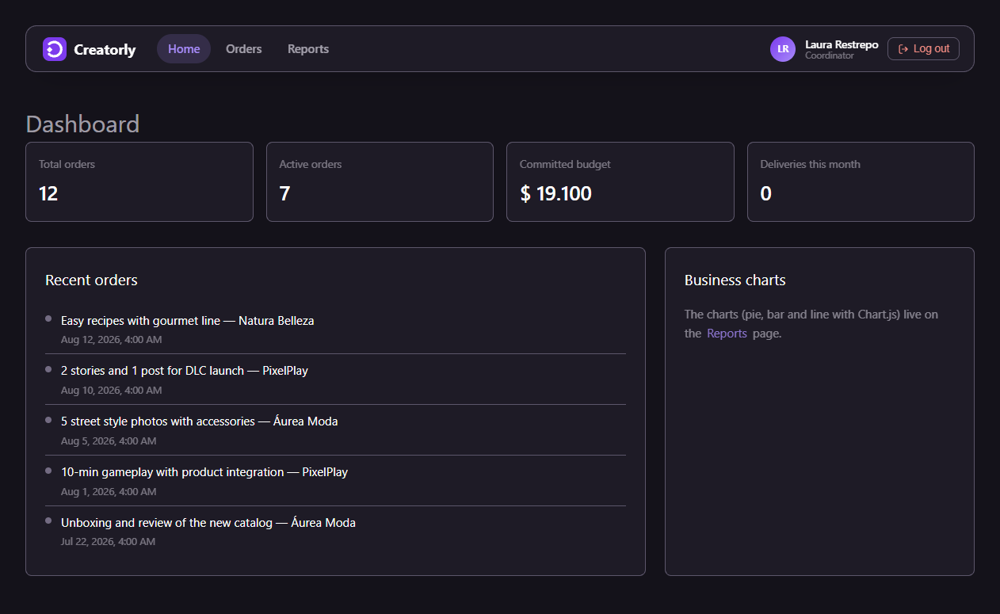 |
| 2 | Login |  |
| 3 | Orders (CRUD #2 + selector/table/Chart.js) | 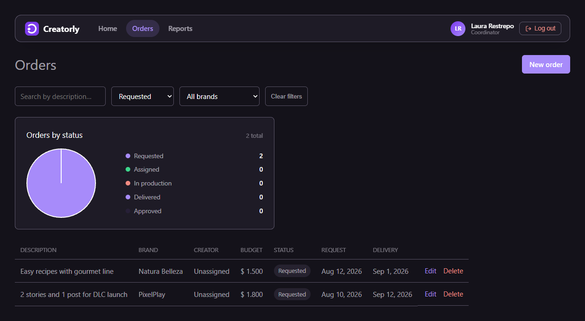 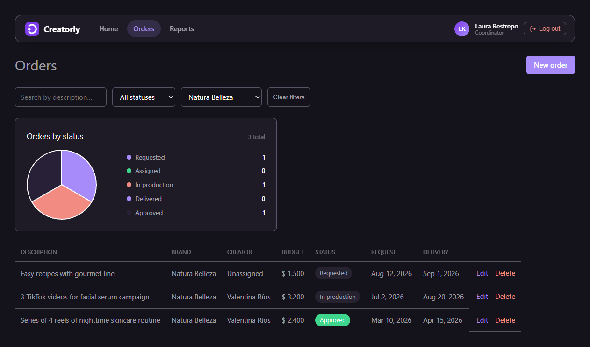 |
| 4 | Create / Edit Order | 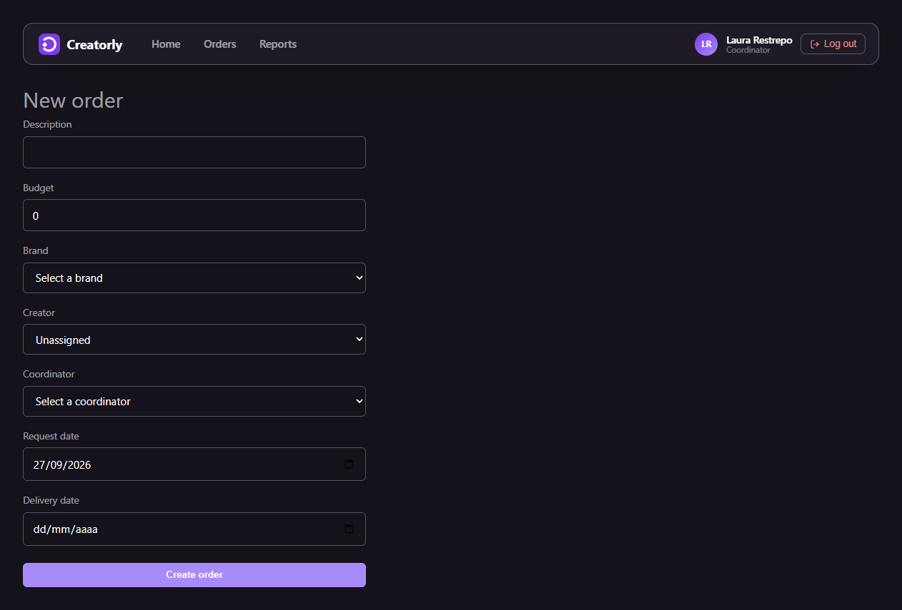 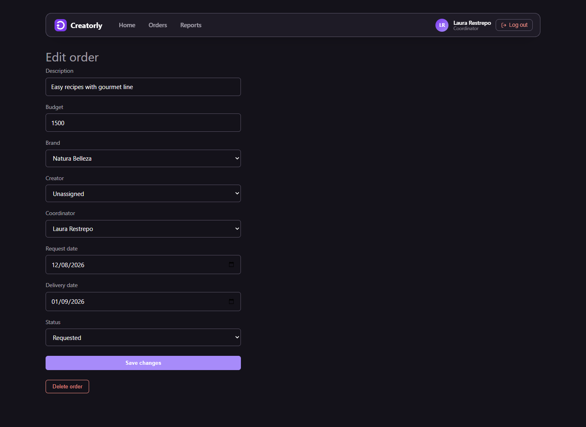 |
| 5 | Creators (admin-only, CRUD #1) | 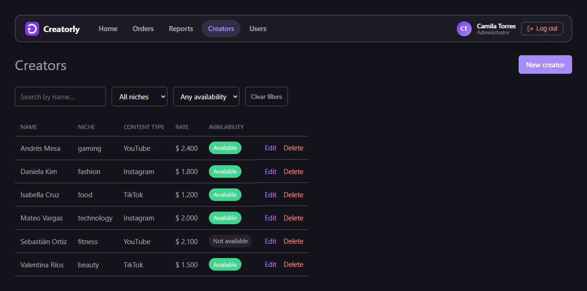 |
| 6 | Reports (selector/table/Chart.js) |    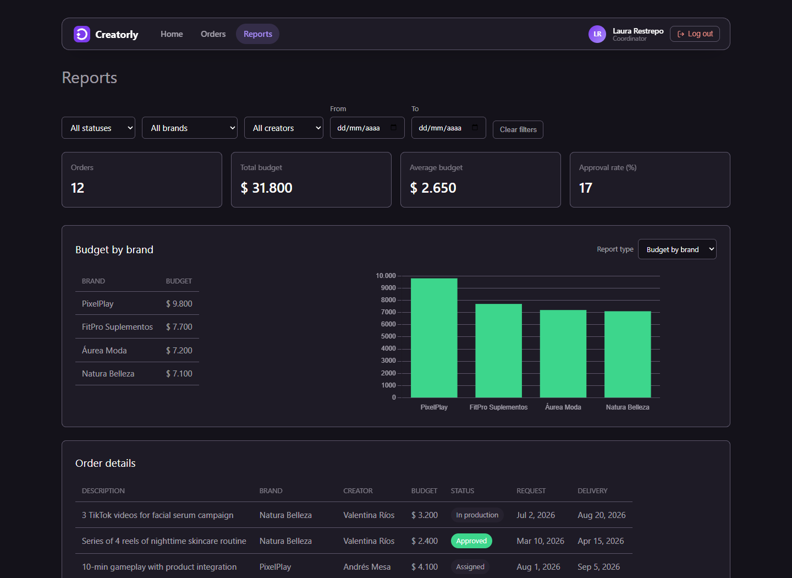 |
| 7 | Users (admin-only) | 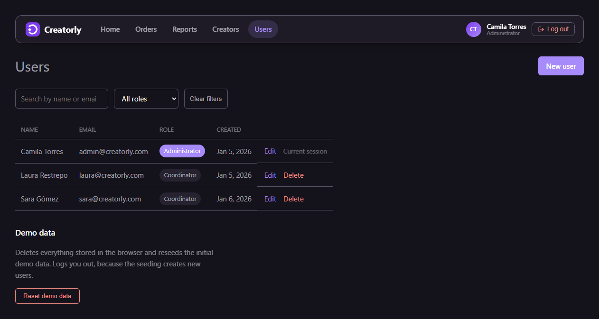 |
