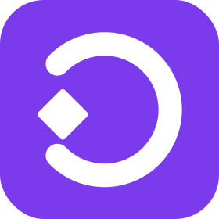

# Identidad de Marca y Sistema de Diseño — Creatorly

Esta página especifica la **identidad de marca** y el **sistema de diseño (Brand Kit)** de Creatorly. Es la fuente de verdad visual y de componentes para todo el equipo (desarrollo de vistas, componentes reutilizables, gráficos y estilos).

---

## 1. Estrategia y Posicionamiento

| Dimensión | Definición |
|---|---|
| **Categoría** | Dashboard interno B2B de operación — gestión de una agencia de creadores UGC |
| **Audiencia** | Personal interno de la agencia: administradores y coordinadores (no público externo, no marcas, no creadores) |
| **Personalidad** | Precisa, conectiva, confiable y moderna — herramienta de trabajo profesional |
| **Metáfora central** | La agencia como tejido conector entre **Marcas** y **Creadores**; cada **Pedido** es el puente que los une a lo largo de su ciclo de vida de 5 estados |
| **Tagline** | *"El puente entre marcas y creadores."* |
| **A evitar** | Estética de redes sociales / influencers, iconografía genérica (cámaras, corazones, botones de play) y colores mágicos |

> **Nota:** El glosario canónico del dominio vive en `CONTEXT.md` (Agencia, UGC, Creador, Marca, Pedido, roles y ciclo de vida).

---

## 2. Logotipo

### 2.1 Concepto
Monograma de la **C** de Creatorly, construido bajo el método *Monogram + Meaning* combinado con *Negative Space*:
- El trazo de la **C** se abre en dos extremos: el extremo superior representa la **Marca** y el inferior al **Creador**.
- Un **rombo** (cuadrado rotado 45°) ocupa la apertura central: representa el **Pedido**, el nodo que siempre conecta a ambas partes.
- La forma nunca se cierra en un círculo completo porque la relación siempre pasa por un pedido activo administrado por la agencia.



### 2.2 Proceso de diseño

El logo se fue construyendo por iteración visual hasta llegar a la forma final: partimos de la idea de la C abierta con el rombo del Pedido en la apertura (sección 2.1), y fuimos ajustando el arco y el nodo central hasta que la proporción se viera bien — sin colores de más, sin relleno decorativo, buscando esa línea minimalista y tecnológica que pide la personalidad de marca de la sección 1.

El wordmark usa la tipografía `Unbounded 600`.

El resultado final ya está verificado sin recortes (ver el PNG arriba). El código de implementación vive en `NavBar.vue`.

### 2.3 Reglas de uso
- **Ícono solo:** favicon, avatar y tamaños pequeños (≥16px).
- **Isotipo + Wordmark:** `[Ícono SVG] Creatorly` para la barra de navegación (`NavBar.vue`), encabezados y pantallas principales.
- **Color del trazo:** `--brand-primary` (`#7c3aed`) en modo claro; `--brand-primary-dark` (`#a78bfa`) en modo oscuro.
- **Inmutable:** el rombo central **siempre** mantiene alto contraste (blanco o fondo claro contrastante), nunca se deforma ni se cierra el arco.

---

## 3. Sistema de Color y Tokens

Todos los estilos de la aplicación deben utilizar estrictamente las variables CSS definidas en `src/assets/base.css`. Está prohibido quemar valores hexadecimales o `rgb/hsl` directos en las vistas y componentes.

### 3.1 Tokens de Marca y Superficies

| Token | Valor (Light / Dark) | Uso en la UI |
|---|---|---|
| `--color-background` | `#ffffff` / `#14121a` | Fondo base de la aplicación y páginas |
| `--color-background-soft` | `#f8f7fb` / `#1e1b26` | Fondos de tarjetas, paneles y barra de navegación (`NavBar`) |
| `--color-background-mute` | `#f1f0f5` / `#26222f` | Filas alternas de tablas, inputs deshabilitados |
| `--color-border` | `rgba(60, 50, 70, 0.12)` / `rgba(160, 150, 180, 0.48)` | Bordes sutiles de tarjetas, inputs, tablas y divisores |
| `--color-border-hover` | `rgba(60, 50, 70, 0.29)` / `rgba(160, 150, 180, 0.65)` | Bordes al hacer hover o focus |
| `--color-heading` | `#2c2340` / `#ffffff` | Títulos `h1`, `h2`, `h3` y encabezados |
| `--color-text` | `#2c2340` / `rgba(237, 233, 245, 0.64)` | Texto general de cuerpo y descripciones |

### 3.2 Tokens Semánticos vs. Marca

* **Acento de Marca (`--color-primary`, `--color-primary-soft`):**
  * Light: `#7c3aed` (`rgba(124, 58, 237, 0.12)`).
  * Dark: `#a78bfa` (`rgba(167, 139, 250, 0.16)`).
  * *Uso:* Botones principales, enlaces activos, bordes de selección y foco interactivo.
* **Éxito (`--color-success`):** `#2fae60` (Light) / `#3dd68c` (Dark).
  * *Uso:* Estado `aprobado` del pedido, confirmaciones exitosas.
* **Peligro / Alerta (`--color-danger`):** `#e0575b` (Light) / `#f28b82` (Dark).
  * *Uso:* Botón de salida/logout, acciones de eliminación, mensajes de error.

> ⚠️ **Regla:** El violeta es el acento de identidad; el verde y rojo son semánticos de estado. No usar violeta para indicar éxito ni verde para decoración.

---

## 4. Tipografía: Sistema de Tres Roles

Para darle carácter visual moderno y técnico al dashboard, la identidad utiliza 3 fuentes con propósitos bien diferenciados:

```
Google Fonts import:
https://fonts.googleapis.com/css2?family=Inter:wght@400;500;600&family=JetBrains+Mono:wght@400;500&family=Unbounded:wght@500;600;700&display=swap
```

| Rol | Tipografía | Peso | Uso obligatorio |
|---|---|---|---|
| **Display / Marca** | `Unbounded` | `600`, `700` | Logotipo / Wordmark, números grandes en tarjetas KPI |
| **Interfaz / Lectura** | `Inter` | `400`, `500`, `600` | Textos de UI, botones, campos de formulario, celdas de tablas |
| **Datos / Código** | `JetBrains Mono` | `400`, `500` | IDs UUID (`crypto.randomUUID()`), labels uppercase, chips de estado, badges de rol (`ADMIN`, `COORDINADOR`) |

---

## 5. Pautas de Componentes de UI (Guía de Implementación)

### 5.1 Tarjetas de Métricas (KPI Cards)
- **Estructura:** Cuadrícula (grid) limpia.
- **Número métrico:** Tamaño grande (`1.75rem` - `2.25rem`), `font-family: 'Unbounded', sans-serif`, `font-weight: 600`, color `--color-primary`.
- **Etiqueta:** `font-family: 'JetBrains Mono', monospace`, `text-transform: uppercase`, tamaño `0.75rem` (`12px`), `letter-spacing: 0.05em`, color `--color-text`.
- **Contenedor:** Fondo `--color-background-soft`, borde `1px solid var(--color-border)`, `border-radius: 8px`, `padding: 1.25rem`.

### 5.2 Badges de Rol de Usuario
- **Texto:** `ADMIN` o `COORDINADOR`.
- **Estilo:** `font-family: 'JetBrains Mono', monospace`, `font-size: 0.75rem`, `font-weight: 500`.
- **Colores:** Fondo `--color-primary-soft`, texto `--color-primary`, `border-radius: 4px`, `padding: 2px 8px`.

### 5.3 Chips de Estado de Pedido (Ciclo de Vida)
El ciclo de vida consta estrictamente de 5 estados en este orden:
`solicitado → asignado → en_produccion → entregado → aprobado`

| Estado | Token de fondo | Token de texto | Nota |
|---|---|---|---|
| `solicitado` | `--color-background-mute` | `--color-text` | Estado inicial neutro |
| `asignado` | `--color-primary-soft` | `--color-primary` | Asignado a un creador |
| `en_produccion` | `--color-primary-soft` | `--color-primary` | En proceso de creación |
| `entregado` | `rgba(59, 130, 246, 0.12)` | `#3b82f6` (azul info) | Esperando revisión |
| `aprobado` | `rgba(47, 174, 96, 0.15)` | `--color-success` | **Siempre verde**, nunca violeta |

### 5.4 Gráficos con Chart.js (`BaseChart.vue`)
Para los gráficos de pedidos y reportes a cargo de Felipe:
- **Paleta de series para gráficos:**
  - Serie principal (ej. total pedidos / presupuestos): `rgba(124, 58, 237, 0.85)` (violeta marca).
  - Serie secundaria o barras comparativas: `rgba(167, 139, 250, 0.5)`.
  - Estados aprobados / completados: `rgba(47, 174, 96, 0.85)` (verde).
  - Estados pendientes / cancelados: `rgba(224, 87, 91, 0.85)` (rojo).
- **Estilo de ejes y leyendas:**
  - `color`: `var(--color-text)`.
  - `font.family`: `'Inter', sans-serif`.
  - `grid.color`: `var(--color-border)`.

### 5.5 Botones, Formularios y Navegación
- **Border Radius estándar:** `6px` para botones e inputs; `8px` para tarjetas; `20px` para pills/chips.
- **Botón Primario:** Fondo `--color-primary`, texto blanco (`#ffffff`), hover con ligera elevación o cambio de opacidad.
- **Navegación Activa (`router-link-active`):** Peso `600`, color `--color-primary` y borde/acento visual inferior o lateral.

---

## 6. Reglas Anti-Genéricas del Proyecto

1. **No a la estética genérica de redes:** Queda descartada la iconografía de cámaras, play buttons, reels, o corazones de "influencer". Creatorly es una herramienta B2B de gestión operativa y presupuestal.
2. **Un solo color de acento de marca:** El violeta es el único acento institucional. El verde y el rojo se reservan exclusivamente para significado semántico (éxito y peligro).
3. **No literalizar el puente:** La metáfora del "puente" se expresa en la arquitectura y en el monograma del logo (la C abierta con su nodo), no usando ilustraciones de puentes físicos.
4. **Respetar los tokens:** Toda regla visual debe consumirse desde `src/assets/base.css` para garantizar compatibilidad total con el modo oscuro y evitar inconsistencias en el diseño.
